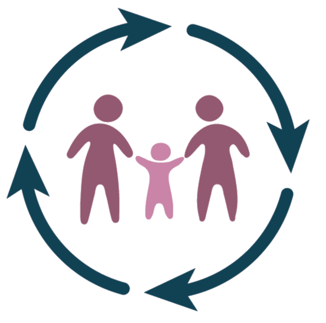

<!-- Improved compatibility of back to top link: See: https://github.com/othneildrew/Best-README-Template/pull/73 -->
<a id="readme-top"></a>

<!-- PROJECT LOGO -->
<br />
<div align="center">
  <a href="https://github.com/PEDSnet/repo_name">
    
  </a>

<h3 align="center">project_title</h3>

  <p align="center">
    project_description
    <br />
    <!-- Uncomment and edit below for a documentation hyperlink. -->
    <!-- <a href="https://github.com/PEDSnet/repo_name"><strong>Explore the docs »</strong></a> -->
    <!-- <br /> -->
  </p>
</div>

<!-- ABOUT THE PROJECT -->
## About The Project

<!-- Edit and uncomment the line below for a product screenshot that links to your site. -->
<!-- [![Product Name Screen Shot][product-screenshot]](https://example.com) -->

<p align="right">(<a href="#readme-top">back to top</a>)</p>

### Built With

We use `renv` for dependency management. The following packages and versions were used:

<!-- DEPENDENCIES_START -->
*DO NOT ALTER (unless manually pasting session info)! Dependencies will be automatically updated here from renv.lock*
<!-- DEPENDENCIES_END -->

<p align="right">(<a href="#readme-top">back to top</a>)</p>

<!-- GETTING STARTED -->
## Getting Started


### Prerequisites


To reproduce this environment, run `git clone https://github.com/PEDSnet/repo_name.git` and restore from `renv.lock`:

```R
renv::restore()
```

### Installation

> **Note:** The installation section below is an example. Please edit it to reflect the specific installation steps for your project.

1. Get a free API Key at [https://example.com](https://example.com)
2. Clone the repo
   ```sh
   git clone https://github.com/PEDSnet/repo_name.git
   ```
3. Install NPM packages
   ```sh
   npm install
   ```
4. Enter your API in `config.js`
   ```js
   const API_KEY = 'ENTER YOUR API';
   ```
5. Change git remote url to avoid accidental pushes to base project
   ```sh
   git remote set-url origin PEDSnet/repo_name
   git remote -v # confirm the changes
   ```

### Developers (Optional)

You can include a list of contributors or developers here to credit those involved in the project. For example:
- **Name**: Role (e.g., Lead Developer)
- **Name**: Role (e.g., Contributor)

<p align="right">(<a href="#readme-top">back to top</a>)</p>


<!-- USAGE EXAMPLES -->
## Usage

Use this space to show useful examples of how a project can be used. Additional screenshots, code examples and demos work well in this space. You may also link to more resources.

<!-- _For more examples, please refer to the [Documentation](https://example.com)_ -->

<p align="right">(<a href="#readme-top">back to top</a>)</p>

<!-- LICENSE -->
## License

Distributed under the project_license. See `LICENSE.txt` for more information.

<p align="right">(<a href="#readme-top">back to top</a>)</p>


<!-- CONTACT -->
## Contact

pedsnetdcc@chop.edu

Project Link: [https://github.com/PEDSnet/repo_name](https://github.com/PEDSnet/repo_name)

<p align="right">(<a href="#readme-top">back to top</a>)</p>


<!-- MARKDOWN LINKS & IMAGES -->
<!-- https://www.markdownguide.org/basic-syntax/#reference-style-links -->
[issues-shield]: https://img.shields.io/github/issues/PEDSnet/repo_name.svg?style=for-the-badge
[issues-url]: https://github.com/PEDSnet/repo_name/issues
[license-shield]: https://img.shields.io/github/license/PEDSnet/repo_name.svg?style=for-the-badge
[license-url]: https://github.com/PEDSnet/repo_name/blob/master/LICENSE.txt
[product-screenshot]: images/screenshot.png
